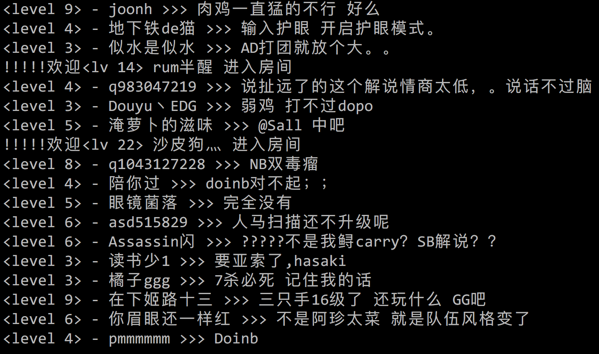

# Danmu.go

## Douyu弹幕简单示例

```go
package main

import (
	"fmt"

	"github.com/importcjj/danmu.go/douyu"
)

// 默认弹幕服务器
const (
	DefaultDouyuDanmuHost = "openbarrage.douyutv.com"
	DefaultDouyuDanmuPort = 8601
)

// DanmuHandle 为自定义的弹幕处理
func DanmuHandle(message *douyu.Message) {
	contentType, ok := message.Field("type")
	if !ok {
		return
	}
	switch contentType {
	// 有多种消息类型.
	case douyu.TypeChatMsg:
		// 默认全部为string
		nick, _ := message.Field("nn")
		level, _ := message.Field("level")
		text, _ := message.Field("txt")
		fmt.Printf("<level %s> - %s >>> %s\n", level, nick, text)
	case douyu.TypeUserEnter:
		nick, _ := message.Field("nn")
		level, _ := message.Field("level")
		fmt.Printf("!!!!!欢迎<lv %s> %s 进入房间\n", level, nick)
	}
}

func main() {
	douyuClient := douyu.New()
	douyuClient.Connect(DefaultDouyuDanmuHost, DefaultDouyuDanmuPort)
	douyuClient.JoinRoom(288016)
	douyuClient.HandleFunc(DanmuHandle)
	douyuClient.Watch()
}
```

注意上述代码中，JoinRoom使用的参数为房间ID，特殊的房间名是不支持的。需要你用浏览器打开该直播间，并使用开发者工具查看主HTML中$ROOM这个对象中定义的room_id字段的值(可使用文本搜索)

### 示例效果

